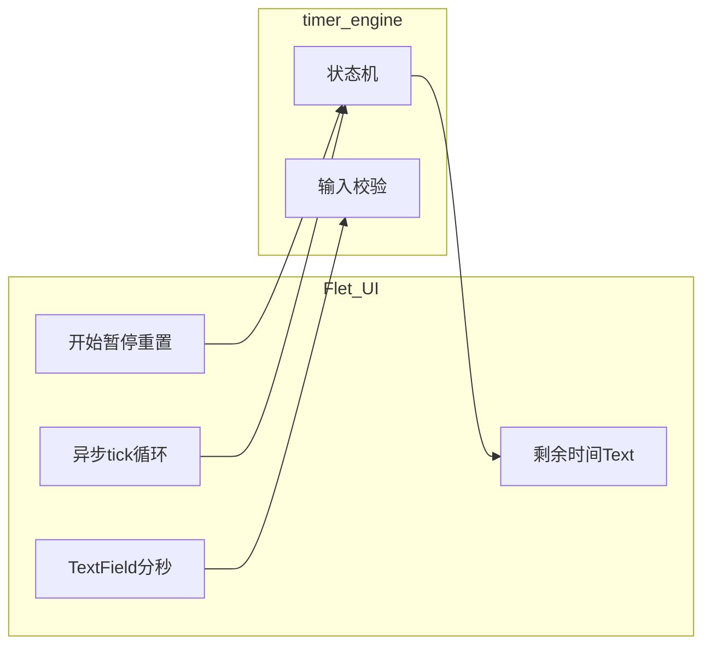

# Flet 桌面倒计时：零基础可执行开发计划

## 1. 这份计划怎么用（给执行者）

- **按章节顺序做**：完成每一小节的「自检」后再进入下一节；不要跳步，否则后面报错难定位。
- **每完成一步就运行程序**：能窗口启动、能倒计时、能打包，各占一个里程碑；不要攒到最后才运行。
- **遇到不懂的词**：先看文末「名词表」，再查 [Flet 文档](https://flet.dev/docs/) 对应页面。
- **你已确认的需求**：首期只做**自由设定分+秒**；**番茄钟下一迭代**；**MVP 要 Windows 可分发 exe**。

---

## 2. 名词表（必读）


| 词                | 含义                                                  |
| ---------------- | --------------------------------------------------- |
| Python 解释器       | 运行 `.py` 文件的程序；安装 Python 后可用 `python --version` 检查。 |
| 虚拟环境 (venv)      | 项目私有的依赖目录，避免全局 `pip install` 弄乱系统。                  |
| pip              | Python 包装管理工具，用来安装 `flet` 等库。                       |
| Flet             | 用 Python 写界面，底层用 Flutter 绘制窗口。                      |
| 入口脚本             | 启动应用的第一个 `.py` 文件，本项目中为 `main.py`。                  |
| 状态机              | 用有限个「状态」描述倒计时在干什么（空闲/运行/暂停），避免逻辑乱套。                 |
| 异步 (async/await) | 让程序在等待（如等 1 秒）时不卡死整个界面；Flet 计时要用到。                  |
| pytest           | 运行自动化测试的工具，用来测 `timer_engine` 不算错。                  |
| flet pack        | Flet 提供的打包命令，生成 Windows 下可双击的文件夹或 exe。              |


---

## 3. 阶段 0：环境与工具（未完成则禁止写业务代码）

### 3.1 安装 Python

1. 从 [python.org](https://www.python.org/downloads/) 下载 **Python 3.11 或 3.12**（64-bit）。
2. 安装时勾选 **Add python.exe to PATH**。
3. 打开 **PowerShell**，执行：

```powershell
python --version
```

**自检**：输出为 `Python 3.11.x` 或 `3.12.x`。

### 3.2 进入项目目录

假设仓库根目录为 `countingdown`（请改为你本机克隆路径）：

```powershell
cd <你的仓库根目录>
```

**自检**：`Get-Location` 指向包含 `src\countdown_app` 的目录。

### 3.3 创建虚拟环境并激活

```powershell
python -m venv .venv
.\.venv\Scripts\Activate.ps1
```

若提示「无法加载，因为在此系统上禁止运行脚本」：

```powershell
Set-ExecutionPolicy -Scope CurrentUser RemoteSigned
```

然后再执行激活命令。

**自检**：提示符前出现 `(.venv)`。

### 3.4 升级 pip（建议）

```powershell
python -m pip install -U pip
```

**自检**：无红色报错即可。

---

## 4. 阶段 1：仓库骨架（空应用能弹出窗口）

目标：目录结构固定；装依赖；**一行命令能看到空白 Flet 窗口**。

### 4.1 要创建的目录与文件（逐条打勾）

在仓库根目录 `countingdown/` 下创建：


| 路径                                  | 作用                                            |
| ----------------------------------- | --------------------------------------------- |
| `src/countdown_app/__init__.py`     | 空文件即可，标记为 Python 包                            |
| `src/countdown_app/main.py`         | 应用入口：创建 `Page`、调用 `flet.app`                  |
| `src/countdown_app/timer_engine.py` | 先建空文件或只写占位注释，阶段 2 再写满                         |
| `tests/__init__.py`                 | 可选空文件                                         |
| `tests/test_timer_engine.py`        | 阶段 2 再写测试                                     |
| `requirements.txt`                  | 锁定 `flet` 版本                                  |
| `.gitignore`                        | 至少忽略 `.venv/`、`dist/`、`build/`、`__pycache__/` |


**自检**：资源管理器中能看到上述树形结构。

### 4.2 `requirements.txt` 写什么

1. 打开 [flet PyPI](https://pypi.org/project/flet/) 看当前稳定版本号。
2. 写入一行，例如（版本号以你查到的为准，不要写模糊范围）：

```text
flet==0.28.3
```

（说明：此处版本仅为示例；实际填写时请替换为安装当日 PyPI 上的稳定版。）

安装：

```powershell
pip install -r requirements.txt
```

**自检**：`pip show flet` 能显示 Version。

### 4.3 最小可运行 `main.py`（先照抄再理解）

在 `src/countdown_app/main.py` 中实现：

- 定义函数 `main(page: ft.Page)`。
- 在 `main` 里设置 `page.title = "倒计时"`（或任意标题）。
- 往 `page` 上放一个简单控件，例如 `ft.Text("Hello")`，并 `page.add(...)`。
- 文件末尾写：

```python
if __name__ == "__main__":
    ft.app(target=main)
```

**自检命令**（在已激活 venv 的 PowerShell 中，仓库根目录执行）：

```powershell
flet run src/countdown_app/main.py
```

或：

```powershell
python src/countdown_app/main.py
```

（以你本机 Flet 版本文档推荐方式为准；若一种不行试另一种。）

**自检**：弹出窗口，能看到 `Hello` 字样。

### 4.4 本阶段常见错误


| 现象                     | 处理                                                                          |
| ---------------------- | --------------------------------------------------------------------------- |
| `flet 不是内部或外部命令`       | 使用 `python -m pip show flet` 确认已安装；用 `python src/countdown_app/main.py` 启动。 |
| `No module named flet` | 确认已 `Activate.ps1`，且在 venv 里 `pip install -r requirements.txt`。             |
| 窗口闪退                   | 在 PowerShell 里运行看报错栈；把 `if __name__` 块写对，不要缩进错误。                            |


---

## 5. 阶段 2：计时逻辑 `timer_engine.py`（不写界面，先写对规则）

目标：**任何人不看界面也能用单元测试证明**倒计时算对。这是给新手最重要的防翻车点。

### 5.1 业务规则（写代码前抄到注释里）

1. **状态**只有三种：`idle`（空闲）、`running`（运行中）、`paused`（已暂停）。
2. **剩余时间**用整数 `**remaining_seconds`**（≥0）。界面显示由它格式化成 `MM:SS`。
3. **开始**：
  - 仅在 `idle` 时：读取用户输入的「分钟 `m`」「秒 `s`」，转成总秒数 `T = m*60+s`。
  - 若 `T <= 0`：**不允许进入 running**，返回明确错误信息（给 UI 显示）。
  - 若 `T` 超过上限（建议 **86400 秒 = 24 小时**）：同样拒绝开始。
  - 通过后：`remaining_seconds = T`，状态变 `running`。
4. **暂停**：仅 `running` → `paused`，时间不动。
5. **继续**：仅 `paused` → `running`，时间不从输入重算。
6. **重置**：任意状态 → `idle`，`remaining_seconds = 0`（或归零标记，二选一但要全项目一致）。
7. **tick（过 1 秒）**：仅当 `running` 时 `remaining_seconds -= 1`；若减完 **≤0**：视为**自然结束**，状态变 `idle`，`remaining_seconds = 0`。

### 5.2 建议的类与公开方法（按名实现即可）

在 `timer_engine.py` 中新建类，例如 `CountdownEngine`：


| 方法                                            | 何时调用              | 成功时                          | 失败时                    |
| --------------------------------------------- | ----------------- | ---------------------------- | ---------------------- |
| `start_from_inputs(minutes_str, seconds_str)` | 用户点「开始」且当前 `idle` | 状态 `running`，剩余秒数正确          | 返回/抛出带信息的错误（二选一，全项目统一） |
| `pause()`                                     | 点「暂停」             | `running`→`paused`           | 非法状态则忽略或返回错误           |
| `resume()`                                    | 点「继续」             | `paused`→`running`           | 非法状态则忽略或返回错误           |
| `reset()`                                     | 点「重置」             | 回 `idle`，剩余 0                | 无                      |
| `tick_one_second()`                           | 异步循环每秒调一次         | 若 `running` 则减秒；到 0 则 `idle` | 无                      |
| `state`（只读属性）                                 | UI 决定按钮是否可点       | 返回当前状态                       | 无                      |
| `remaining_seconds`（只读）                       | UI 刷新显示           | 返回 int                       | 无                      |


**建议再提供**静态或模块函数：`format_mmss(seconds: int) -> str`，把 125 变成 `"02:05"`（注意前导零）。

### 5.3 输入校验规则（必须写进代码与测试）

对字符串输入（因为 `TextField` 给的是字符串）：


| 输入            | 期望                                   |
| ------------- | ------------------------------------ |
| 空字符串          | 按 0 处理或报错（二选一，**与 UI 提示一致**；建议非法则报错） |
| `"5"`         | 合法数字                                 |
| `" 5 "`       | 先去首尾空格再转 int                         |
| `"abc"`       | 拒绝开始，错误信息包含「请输入整数」                   |
| 分钟 `"999999"` | 超过 24h 上限则拒绝                         |


**自检**：不运行窗口，只运行 pytest（阶段 2 末尾）。

### 5.4 `tests/test_timer_engine.py` 必备用例表（逐条实现）

每条用例对应一个 `test_xxx` 函数：


| 编号  | 操作序列                             | 期望                 |
| --- | -------------------------------- | ------------------ |
| T1  | `start(0,0)`                     | 失败，仍为 `idle`       |
| T2  | `start(1,5)`                     | `running`，剩余 65    |
| T3  | `start` 后 `tick` 65 次            | `idle`，剩余 0        |
| T4  | `start(0,10)` → `pause` → `tick` | 剩余仍为 10（pause 时不减） |
| T5  | `pause` → `resume` → `tick`      | 剩余 9               |
| T6  | `reset` 任意时刻                     | `idle`，0           |
| T7  | `"abc"` 分钟                       | `start` 失败         |
| T8  | 总时长超过 86400                      | `start` 失败         |


运行：

```powershell
pip install pytest
pytest tests/test_timer_engine.py -v
```

**自检**：以上用例全部绿色通过。

---

## 6. 阶段 3：界面与异步计时（把引擎接上 Flet）

目标：用户能设时间、开始、暂停、继续、重置；每秒刷新；关掉窗口不报错。

### 6.1 页面控件清单（建议变量名）

在 `main` 或单独 `ui.py` 中创建并保持引用（以便事件里修改）：


| 控件               | 变量名示例             | 作用                        |
| ---------------- | ----------------- | ------------------------- |
| `TextField`      | `field_minutes`   | 输入分钟                      |
| `TextField`      | `field_seconds`   | 输入秒                       |
| `Text`           | `label_remaining` | 大号 `MM:SS`                |
| `ElevatedButton` | `btn_start`       | 开始/继续（可用同一按钮改文字，或两个按钮二选一） |
| `ElevatedButton` | `btn_pause`       | 暂停                        |
| `ElevatedButton` | `btn_reset`       | 重置                        |


布局建议：`Column` 里依次放标题、剩余时间、`Row` 放两个输入框、`Row` 放三个按钮。

### 6.2 按钮启用规则（避免用户乱点）

用 `button.disabled = True/False` 根据 `engine.state` 更新（可在每个事件末尾调用 `refresh_controls()`）：


| 状态            | 开始/继续       | 暂停  | 重置                   |
| ------------- | ----------- | --- | -------------------- |
| `idle` 且剩余为 0 | 启用（开始）      | 禁用  | 可选禁用或启用（若启用则重置无效果也可） |
| `running`     | 禁用或改为「继续」禁用 | 启用  | 启用                   |
| `paused`      | 启用（继续）      | 禁用  | 启用                   |


（实现时可微调，但**必须在 README 或注释写清**，并手动测一遍。）

### 6.3 异步循环（每秒一次）

1. 在 `main` 里创建 `CountdownEngine` 实例。
2. 定义 `async def tick_loop():`，内部 `while True:`：
  - `await asyncio.sleep(1)`
  - 调用 `engine.tick_one_second()`
  - 更新 `label_remaining.value`（或 `update()`）
  - 若检测到「刚从 running 刚到 idle 且由归零引起」，弹出 `page.snack_bar` 或 `open_dlg`：**倒计时结束**
3. 在页面加载后 **只启动一次** 该任务：`page.run_task(tick_loop)`（API 名以当前 Flet 版本为准；若文档写法不同，按文档替换，但逻辑不变）。

### 6.4 关闭窗口时取消循环（必做）

- 使用 **取消令牌**模式：设 `running_flag = True`，`on_close` 里置 `False`，`tick_loop` 每次 sleep 后检查，为 False 则 `break`。
- 或查阅当前 Flet 版本是否对 `run_task` 返回的 task 可取消，按官方推荐写法。

**自检**：关掉窗口后，PowerShell 不再每秒刷错误；CPU 不占满。

### 6.5 手动验收脚本（必须一条条做）

1. 输入 `0` 分 `10` 秒，开始，显示 `00:10`，十秒后变 `00:00` 并提示结束。
2. 开始后到 `00:05` 点暂停，数字停住；再点继续，继续走。
3. 运行中点重置，立刻 `00:00` 且可重新输入。
4. 输入非法字符，点开始，有明确提示，不崩溃。
5. 连续快速点开始两次，不应出现负数或状态错乱（应用 `disabled` 规则修复）。

---

## 7. 阶段 4：Windows 打包（MVP 交付）

### 7.1 安装打包依赖

通常 `flet pack` 会依赖 PyInstaller；若命令行提示缺少，则：

```powershell
pip install pyinstaller
```

（以报错提示为准。）

### 7.2 打包命令（优先文件夹模式）

在仓库根目录、venv 已激活：

```powershell
flet pack src/countdown_app/main.py --name Countdown --onedir
```

**自检**：`dist/` 下出现 `Countdown` 文件夹，其中有可执行文件；复制到**另一台未装 Python 的 Windows** 或本机临时退出 venv 后双击运行。

### 7.3 `README.md` 最少写三章（给未来的你）

1. **开发运行**：venv、pip install、启动命令。
2. **测试**：`pytest ...`。
3. **打包**：完整 `flet pack` 命令 + 产物路径 + 「若杀软拦截如何处理」（加白名单/用 onedir）。

### 7.4 打包常见问题


| 现象    | 说明                                                    |
| ----- | ----------------------------------------------------- |
| 体积大   | 正常现象（内含运行时）。                                          |
| 杀软报警  | 可申诉或加信任；优先分发文件夹而非单文件有时更稳。                             |
| 双击无反应 | 用 `cmd` 在该目录运行 exe 看报错；必要时加 `--debug-console`（若版本支持）。 |


---

## 8. 阶段 5：持续迭代怎么排（番茄钟下一版）

### 8.1 每个小版本固定格式

- **版本号**：如 `0.1.0`（MVP）、`0.2.0`（番茄钟）。
- `**CHANGELOG.md` 一条记录**：新增/修复/已知问题。
- **合并条件**：pytest 绿 + 手动验收脚本过 + 打包能跑。

### 8.2 番茄钟 `0.2.0` 建议拆分（实现时不写在本期代码里，只排期）

1. 增加预设按钮：25 分、5 分、15 分（直接设置 `remaining_seconds` 或调用 `start_from_preset`）。
2. 结束提示后「一键开始休息」流程。
3. （可选）每日计数，需本地存 json（再下一版也可）。

---

## 9. MVP 完成定义（评审对照表）

- 零基础按「阶段 0～4」能复现构建，无跳步缺口。
- `pytest` 中 T1～T8 全部通过。
- 手动验收 6.5 五条全过。
- `flet pack` 产物在无 Python 机器烟测通过。
- `README.md` 含开发/测试/打包三步。

---

## 10. 架构关系（给新人建立心智模型）




**原则**：`timer_engine` **不 import flet**；测试只测 engine；UI 只调 engine 的公开方法。

---

## 11. 参考链接（遇到 API 不确定时查）

- [Flet 文档首页](https://flet.dev/docs/)
- [Controls / TextField / Button](https://flet.dev/docs/controls)
- [flet pack](https://flet.dev/docs/cli/flet-pack/)
- [pytest 入门](https://docs.pytest.org/en/stable/getting-started.html)

